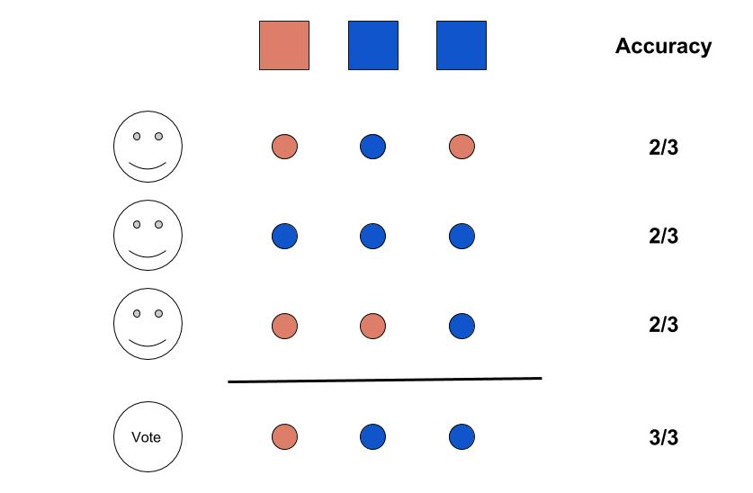
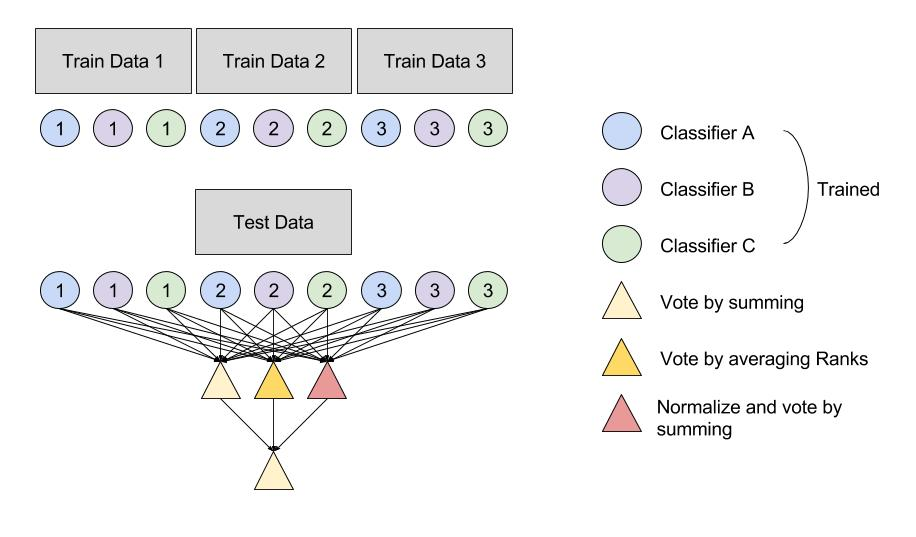
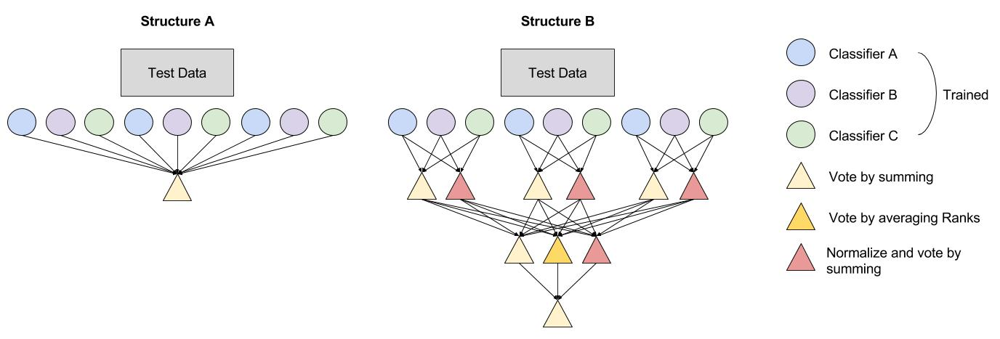

# Deep Ensembling

Work in progress !

Deep_ensembing is a package that let you train models on different data-sets and combine their prediction to build a robust predictive model. This package is intended to prediction problems meeting the following criteria :
- Several full data sources (both features and outcomes available) available
- A binary classification problem

This package let you define easily what kind of classification model to build and how to combine them. The outcome of the workflow is a robust predictive model that is likely to perform very well on a new data source.



## How to use : Train models

The script training.py allows you to train multiple binary models on multiple training Datasets in parallel.
The following lines will train a LogisticRegression, a NearestNeighbor and a RandomForest classifier on the list of dataset provided in X_train_list and y_train_list (each of the data in the list X_train_list must share the same second dimension) :

```python
import training as train

model_list = ['lr','rf','nn']  # The models you want to train ('lr','rf','nn' or 'svm')
params_list = [(1,4),(0,0),(80,150)] # The associated parameters range
output_filename = 'TrainedModels.p' # The name of the output files where estimators will be saved
train.main(X_train_list,y_train_list,model_list,params_list,output_filename=output_filename) # Train !
```
This will pickle the trained models in output_filename.



Options include :
- para : if para=1 run in parallel 
- model_type : if model_type='concat' trained concatenated models (concatenate all dataSet but one and train models on this concatenation, do it for each hold-out DataSet).

## How to use : Build Ensembling Structures

This package allows you to create your own from very simple to very complex "Ensembling method". 

A structure is defined as an object from class 'Network'. When no 'links' between layers are mentionned the default is fully-connected. We show code to create the two structures shown in the figure below.

```python
from ensembling import *

#### Structure A 
N=Network() # Define Network
N.add_layer("Models_layer",[]) # First layer
N.add_layer("Output_layer",[Vote("simple")])  # Last Layer

#### Structure B 
N=Network() # Define Network
N.add_layer("Models_layer",[]) # First layer

n_input_models_per_source = 3 # Second layer
n_sources = 3
n_output_models_per_source = 2
N.add_layer("Hidden_layer",[Vote("simple"),Vote("norm")])
N.layers[1].links = create_independent_links(n_input_models_per_source,n_sources,n_output_models_per_source)

N.add_layer("Hidden_layer",[Vote("simple"),Vote("rank"),Vote("norm")]) # Third Layer
N.add_layer("Output_layer",[Vote("simple")])  # Fourth Layer
```


Some default structures are provided in '/Structures/'

```python
from create_network import *

net_name = 'Network_1L_simple'
network = load_net(net_name) # This is a network
```

## How to use : Test models

The script testing.py allows you to test you trained models. More importantly it allows you to have them vote in a structured way that you can define. We provide a default structure :

The following lines will test the AUC of the 'network' with the 'estimators' on X_test,y_test (X_train and y_train are used only if the network involve 'meta-model' or 'stacking' and therefore need to be trained).

```python
from testing import *

ens = Ensemble(estimators,network_file) # Define Ensembling method
plot_graph(net) # Plot ensembling structure

ens.train(X_val,y_val) # Train the meta models on some validation data
res = ens.eval(X_test,y_test) # Evaluate each estimator on each layer of the ensembling structure

plot_graph(net,results = res) # Plot ensembling results
```

<!--Options inlcude :-->
<!--- skip_models : list of model names to skip (among 'lr', 'nn', 'rf', 'svm')-->
<!--- para : if para=1 run test in parallel-->
<!--- DataSets : list of source index to take into account (default is all)-->
