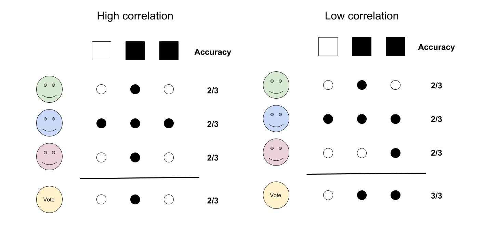
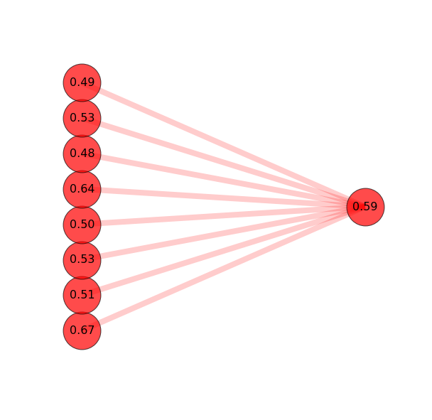
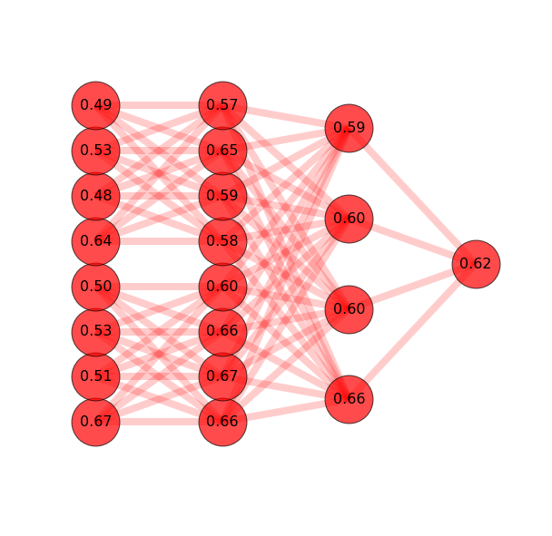

# Deep Ensembling

Work in progress !

Deep_ensembing is a package that let you train models on different data-sets and combine their prediction to build a robust predictive model. This package is intended to prediction problems meeting the following criteria :
- Several full data sources (both features and outcomes available) available
- A binary classification problem

This package let you define easily what kind of classification model to build and how to combine them. The outcome of the workflow is a robust predictive model that is likely to perform very well on a new data source.

<!---->


## How to use : Train models

The script training.py allows you to train multiple binary models on multiple training Datasets in parallel.
The following lines will train a LogisticRegression, a NearestNeighbor and a RandomForest classifier on the list of dataset provided in X_train_list and y_train_list (each of the data in the list X_train_list must share the same second dimension) :

```python
import training as train
import itertools

model_list = ['lr','rf','nn']  # The models you want to train ('lr','rf','nn' or 'svm')
params_list = [(1,4),(0,0),(80,150)] # The associated parameters range
estimators = train.main(X_train_list,y_train_list,model_list,params_list) # Train !
estimators_list = list(itertools.chain(*[x.values() for x in estimators.values()])) # Parse estimators
```
This will pickle the trained models in output_filename.

<!---->

Options include :
- para : if para=1 run in parallel 
- model_type : if model_type='concat' trained concatenated models (concatenate all dataSet but one and train models on this concatenation, do it for each hold-out DataSet).

## How to use : Build Ensembling Structures

This package allows you to create your own from very simple to very complex "Ensembling method". 

A structure is defined as an object from class 'Network'. When no 'links' between layers are mentionned the default is fully-connected. We show code to create the two structures shown in the figure below.

```python
from ensembling import *

#### Structure A 
Na=Network() # Define Network
Na.add_layer("Models_layer",[]) # First layer
Na.add_layer("Output_layer",[Vote("simple")])  # Last Layer

#### Structure B 
Nb=Network() # Define Network
Nb.add_layer("Models_layer",[]) # First layer
Nb.add_layer("Hidden_layer",[Vote("rank"), Model("lr",-3,6),Vote("simple")])
Nb.add_layer("Output_layer",[ Model("lr",-3,6)])  # Last Layer   Model("lr",-3,6)
```
<!---->

Some default structures are provided in the 'Structures' folder

```python
from create_network import *

net_name = 'Network_1L_simple'
network = load_net(net_name) # This is a network
```

## How to use : Test models

The script testing.py allows you to test you trained models. More importantly it allows you to have them vote in a structured way that you can define. We provide a default structure :

The following lines will test the AUC of the 'network' with the 'estimators' on X_test,y_test (X_train and y_train are used only if the network involve 'meta-model' or 'stacking' and therefore need to be trained).

```python
from testing import *

ens = Ensemble(estimators,network=Na) # Define Ensembling method
plot_graph(ens.network) # Plot ensembling structure

ens.train(X_val,y_val) # Train the meta models on some validation data

# Display performance
res = ens.eval(X_test,y_test) # Evaluate each estimator on each layer of the ensembling structure
plot_graph(net,results = res) # Plot ensembling results

# Output predictions
y_pred = ens.network.predict(X_test) # Forward pass in network to get final predictions


```
<!---->

<!---->

## Example : MNIST Digits
This is a simple example with only 1 dataset. 

Preparing data for the task of classifying odd vs even hand-written digits.
```python
from sklearn.datasets import load_digits

# Data : the MNIST Data (small)
digits = load_digits(10)
X,y = digits.data,digits.target

# Labels = odds/even numbers
for label in range(10):
    y[y==label]=label%2

# Shuffle and split data
X,y = shuffle(X,y,random_state=0)
n_train = int(0.8*np.shape(digits.data)[0])
X_train, y_train = X[:n_train],y[:n_train]
X_test, y_test = X[n_train:],y[n_train:]
```

Learning predictors and ensembling structures. For several datasets, ``` [X_train], [y_train]``` should be replaced by two lists ``` X_train_list, y_train_list```.
```python 
model_list = ['lr','rf','nn']  # The models you want to train ('lr','rf','nn' or 'svm')
params_list = [(1,4),(0,0),(6,7)] # The associated parameters range
estimators = train.main([X_train],[y_train],model_list,params_list) # Train !
estimators_list = list(itertools.chain(*[x.values() for x in estimators.values()]))
```

Defining ensembling structure
```python
Na=Network() # Define Network
Na.add_layer("Models_layer",[]) # First layer
Na.add_layer("Output_layer",[ Vote("simple")])  # Last Layer

Nb=Network() # Define Network
Nb.add_layer("Models_layer",[]) # First layer
Nb.add_layer("Output_layer",[ Model("lr",-3,6)])  # Last Layer
```

Apply struture to the set of estimators
```python
ens = Ensemble(estimators_list,network=Na)  # resp Nb
ens.train(X_train,y_train)
y_pred = ens.network.predict(X_test)
```

Accuracy on test 
- Individual classifiers : lr (86%),rf (88%), nn (98.9%)
- Network structures : Na (99.2%)   Nb (99.4%)
