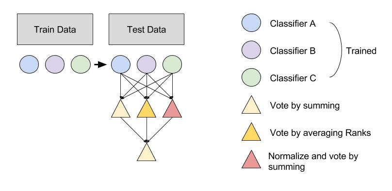

# Deep Ensembling

Work in progress !

Deep_ensembing is a package that let you train models on different data-sets and combine their prediction to build a robust predictive model. This package is intended to prediction problems meeting the following criteria :
- Several full data sources (both features and outcomes available) available
- A binary classification problem

This package let you define easily what kind of classification model to build and how to combine them. The outcome of the workflow is a robust predictive model that is likely to perform very well on a new data source.

## How to use : Train models

The script training.py allows you to train multiple binary models on multiple training Datasets in parallel.
The following lines will train a LogisticRegression, a NearestNeighbor and a RandomForest classifier on the list of dataset provided in X_train_list and y_train_list (each of the data in the list X_train_list must share the same second dimension) :

```python
import training as train

model_list = ['lr','rf','nn']
params_list = [(1,4),(0,0),(80,150)]
output_filename = 'TrainedModels.p'
train.main(X_train_list,y_train_list,model_list,params_list,output_filename=output_filename)
```
This will pickle the trained models in output_filename.

Options include :
- para : if para=1 run in parallel 
- model_type : if model_type='concat' trained concatenated models (concatenate all dataSet but one and train models on this concatenation, do it for each hold-out DataSet).

## How to use : Build Ensembling structure

The capability of this package is the possiblity to create your own "Ensembling method" with very little code. 

As an example, we provide a default structure :
- create_net_func = create_simple_network : is a structure where all provided models vote in three different ways (classic sum-vote, rank-based vote, and normalized vote), then those three votes are aggregated using a last classic vote to produce the final output. The figure below illustrate this basic structure.




## How to use : Test models

The script testing.py allows you to test you trained models. More importantly it allows you to have them vote in a structured way that you can define. We provide a default structure :
- create_net_func = create_simple_network : is a structure where all provided models vote in three different ways (classic sum-vote, rank-based vote, and normalized vote), then those three votes are aggregated using a last classic vote to produce the final output.

The following lines will test the AUC of all pre-trained models in 'TrainedModels.p' on the list of DataSet provided in X_test_list, y_test_list (second dimension of DataSets in X_test_list must be the same as the second dimensions of the DataSets used during training).

```python
import testing as test
import pickle

models = pickle.load(open('TrainedModels.p','rb'))
results = test.test_all_models(models,X_test_list,y_test_list)
```
You can also visualize the AUC of the models on different test DataSet.

```python
import testing as test

target = 0
courses = range(len(X_test_list))
source_courses = [c for c in courses if c!= target]

contracted_results = test.contract_results(results,target,courses)
contracted_results = test.contracted_result_toList(contracted_results,source_courses)

problems_description = 'problem (12,6)'
plot = ggplot_scores(contracted_results,target,source_courses,problems_description)
plot
```

